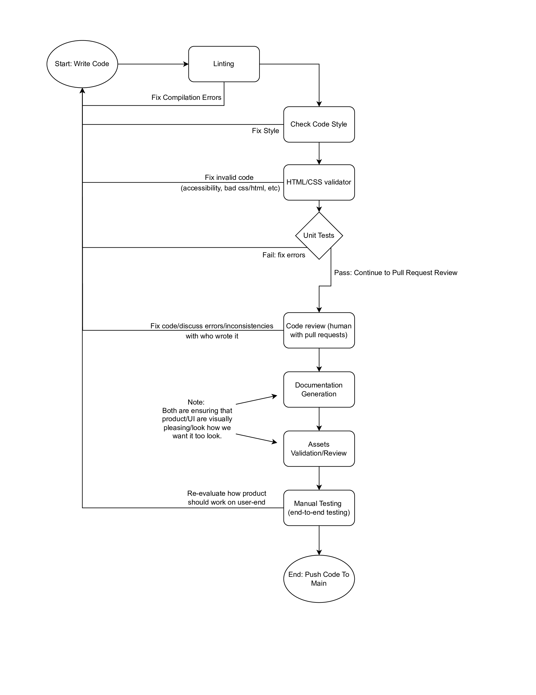

# CI/CD Pipeline Phase 1 Report

## Pipeline Diagram

---

## Overview

This document summarizes the current state and future plans for our CI/CD pipeline, implemented using **GitHub Actions**. The pipeline is designed to automate essential checks such as linting, testing, documentation, and code reviews to improve code quality and maintain development efficiency.

Our goal in Phase 1 is to build a foundational, testable CI process using experimental code and setup—not full production builds. This sets the groundwork for more sophisticated CI/CD functionality in later phases.

---

## Pipeline status: In progress, mostly completed

The status of the pipeline is mostly completed, but few parts are still in progress as detailed below. The diagram for the pipeline has been created and is shown above.

---

### Function Features

#### Linting
We implement linting for our Javascript code with the ESLint node package. Running the linter ensures that our Javascript code is free from syntax errors and enables us to catch potential bugs early on in our development.

#### Code Format Checking
We use the Prettier node package to check that the code we write adheres to our coding style guidlines. This ensures that our code will be uniform in style for things like spacing, indents, semicolons, and line length, making it easier to read, maintain, and review across the team.

#### HTML/CSS Validator
We have implemented the HTML and CSS validator using Cyb3r-Jak3's html5validator-action on GitHub Actions. This ensures all HTML and CSS files in the project adhere to web standards, helping to catch structural errors, and improve accessibility.

#### Unit Tests
We use Jest to run automated tests for utility functions, ensuring the correctness of core logic on every commit or pull request.

--- 

### In-Progress

#### Human Code Review with Pull Requests
Team members will manually review pull requests as an additional quality check to ensure not only correctness but also that the overall direction and structure of the code align with project goals. If any issues or inconsistencies are found, they will be discussed with the author, and the necessary updates will be made collaboratively.

#### Assets Validation/Review
Just as a user, maintain a consistent and performant UI asset pipeline. Ensure continunity between UI assets and any other elements that are being

#### Manual Testing (end-to-end)
The code will be manually tested by developers to evaluate the functionality and visual aspects. Developers will visit the application, simulating potential user actions. If an area is missing visual/aesthetic aspects or lacks performance quality, the developers will return to the code. They will make improvements and modify the existing code to meet developer and user expectations. Once stable, we will use https://playwright.dev/ as another method of manual testing. This resource will be utilized to automate manual testing, allowing for greater time efficiency and verification of results. Additionally, we may communicate with other groups and ask them to test the application. This method of manual testing could provide more useful feedback in terms of quality and cleanliness. 

--- 

### Planned for the Future

#### Documentation Generation
We are planning to use JSDoc to generate directly from annotated JavaScript source code. At the moment, we can generate documenation html pages locally and are in the progress of publishing them to Github pages automatically with Github actions.

