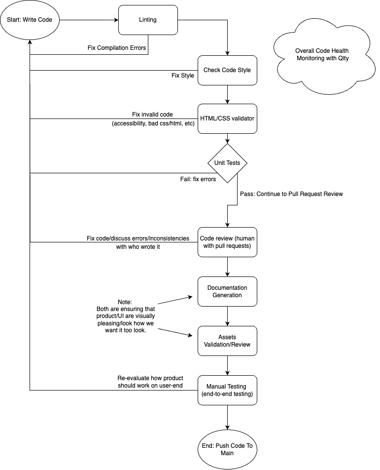
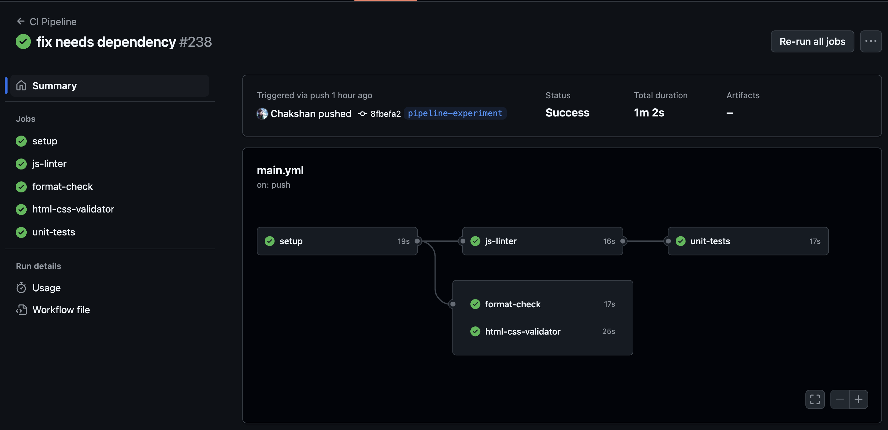
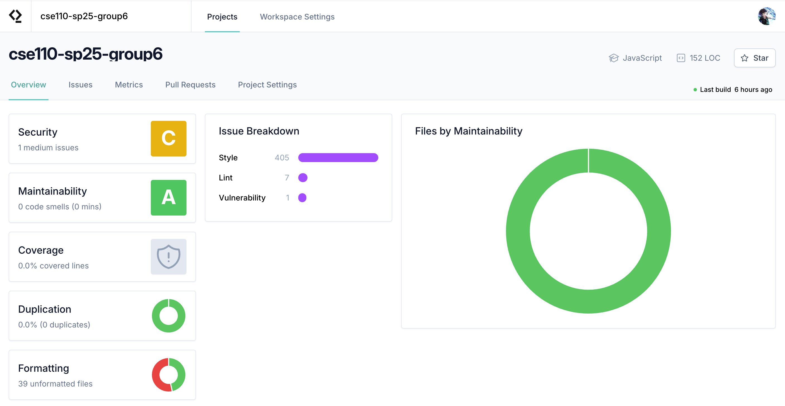

# CI/CD Pipeline Phase 2 Report

## Pipeline Diagram

---

## Work and Evolution Since Phase 1

### Experimentation with Parallelization
We experimented with running status checks in parallel in hopes running independent tests faster than running then in series as shown in one of test runs below.

However, despite running the tests in parallel, we found that this took much longer than simply running the tests in series. This is likely due to the overhead of creating new docker instances for each job that has to run in the parallelized pipeline. Hence, we decided to stick with the serial pipeline for its simplicity and also speed.

### Caching NPM Packages
One improvement to our CI/CD Pipeline we made is the addition of caching our npm packages. We did this via the `actions/cache` Github action. This enables us to cache npm packages between workflow runs on Github. Since our npm packages used to run our status checks don't change much or only get added to over time, it makes sense to keep them cached. By doing so, we expect that our status checks will take less time to run and improve the efficiency of our CI/CD Pipeline

### Monitoring Code Quality with Qlty
We begun using Qlty (originally CodeClimate), a cloud-based code health platform, to aid in monitoring the quality of our code. We added Qlty to our Github repository, and as shown below it has given us several useful statistics regarding things like the maintainablity, security, and formatting of our code.

We aim to use the analysis that Qlty provides to improve our code in the categories it evaluates.

### In Progress & Future
In the next couple weeks, we aim to work on:
- Adding end-to-end tests once our application stablizes
- Document generation