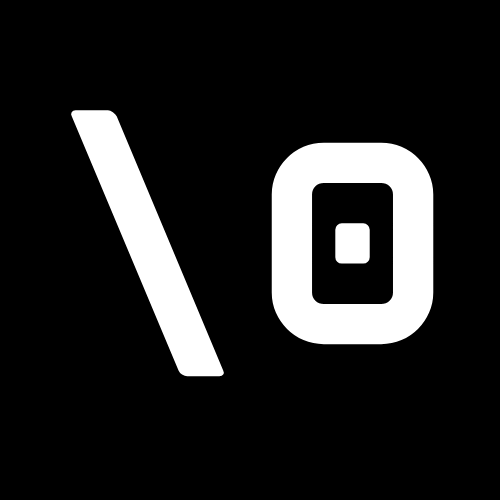

# We are the Null Terminators 

## Values & Team Culture
- Respect one another’s ideas
- Accountability and Responsibility for your work
- Open Communication and Collaboration

## Meet the Team

### Abdirahman Mohamed 
**Bio**: I’m a fourth-year computer science major at UCSD. I’ve heard a few things about software engineering but haven’t taken a class on it before. I hope to learn some cool things about software. Other than that, I’m just a chill guy who likes hanging out with family and friends, binge-watching TV series, and playing sports. I hope that we can all work together and learn something new in this class.  
**Website**: https://a7mohamed.github.io/GithubPages

### Adrian Vo
**Bio**: Hi! I am a 3rd year Math-CS Major. I am excited to learn more about building software in a team setting. In my free time, I play pickleball with my friends, go to the gym, and watch a variety of shows. I love to eat food and I’m always open to finding new places to try.  
**Website**: https://addrain1.github.io/CSE-110-Lab-1/

### Andrew Zhao
**Bio**: Hello! I am a 3rd year computer science major at UCSD. Apart from programming, and school I mainly enjoy talking to my friends and playing games. I am hoping that this class will help me better understand the field that I am preparing to go into and most importantly prepare me for the road ahead. I am looking forward to seeing the progress that our team makes but most importantly I hope to learn and have fun.  
**Website**: https://darkcatz.github.io/CSE110-LAB1/ 

### Anna Covaliov
**Bio**: I am a third year computer science student at UCSD. Outside of school I enjoy spending time outdoors, particularly at the beach. Additionally, I enjoy spending time with family and friends. I look forward to gaining more experience working with a group on the upcoming 
**Website**: https://annacov783.github.io/pages/ 

### Blake Newhouse
**Bio**: I am a second-year computer science student at UC San Diego. I enjoy watching sports, as well as playing both volleyball and basketball. Although I don’t have much experience with software development, I hope to learn a great deal about it in this class and gain hands-on experience in the field in the future. Aside from sports and studying, I love going to the beach and surfing, snowboarding, and just hanging out with friends.  
**Website**: https://blakenewhouse.github.io/About-Me 

### Chakshan Kothakota
**Bio**: I’m a second year computer science student at UCSD. I haven’t had much experience with software development, but I really enjoy making things, and I’m excited to see what our team can create this quarter. When I’m not programming, I enjoy going to the gym, watching anime, and hanging out with my friends. I look forward to seeing how much our team can grow and also having fun along the way.  
**Website**: https://chakshan.github.io/cse110-lab-week1/ 

### Ferrari Guan
**Bio**: I am a second-year Computer Engineering student at UCSD. I like to work on computer hardware and read about linguistics. For extracurricular activities, I am a technical lead for Project in a Box, a full stack web developer for the Triton Engineering Student Council, and an officer for the supercomputing club.  
**Website**: https://b2bomber2.github.io/cse110-lab1/

### Joshua Caneday
**Bio**: I am a second year Computer Science student at UCSD. I like to workout and play the guitar when I’m not doing school work. I only have had experience with programming through personal projects and school work. I am excited to hopefully gain the experience and knowledge that will help me in the future with career growth.  
**Website**: https://joshcaneday.github.io/PagesProject/

### Khuyen Lai
**Bio**: Hi! My name is Khuyen and I am a 3rd year math- school major. I like playing tennis, watching anime, and going to student org events. While I’ve worked on projects as a team before, I hope that we’ll get to learn a lot, bond, and succeed as a team.
**Website**: https://khuyenlai.github.io/CSE110LAB1/index.html

### Lia Chai
**Bio**:  
**Website**:

### Yanhua Liu
**Bio**: I am a 4th year computer engineering student at UCSD. I haven't much experience with software engineering, but I hope I can find a fun team and enjoy this class. I love hiking and playing video games. I'm thinking of a future career in the gaming industry or in circuits for that matter. Good to see you guys.  
**Website**: https://boscoliu0.github.io/cse110/