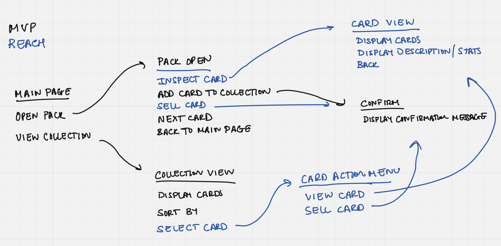

# Specifications

## Main Subsystems
- [**Card Component**](#card-component)
- [**Card Database**](#card-database) 
- [**Pack Opening**](#pack-opening)  
- [**Collection** ](#collection) 

## Main Pages
- Home Page
- Pack Opening Page
- Collection Page

### Site Flow


... add link to miro wireframe ...

## Card Component
### Overview
The main content / resource for the user to collect is the card. So its appearance and quality must be maintained across our website. Hence, we need a way to easily generate and add cards to pages on our website in manner where we don't have to worry about its styling or if other surrounding code will disrupt the appearance / functionality of the card. The aim of creating a custom card component is to accomplish this.

### Properties
```json
"name" : (String),
"image" : (path / url),
"acquisition" : (Date),
"rarity" : (Enum),
"stats" : {},
...
```

### Architecture / Implementation
- Potential key files: 
  - cardComponent.js
  - cardComponent.css
- Should be generated as a custom HTML component using data from a JSON object in the format specified above
- Must be able to scale in size while preserving the card layout (aspect ratio, relative font size, image quality) so as to allow the card to placed in any container with any size

### Reach Features
- Custom animations for each card (?)

## Card Database
### Overview
In order to supply the user with cards in a luck-based manner, we need a way to randomly select / generate cards. Hence, we need a database to hold the data for all of the possible cards the user could get. This database should have interface for returning the data of a random card.

### Interfaces
```javascript
getRandomCard() 	// returns a card object
...
```

### Architecture / Implementation
Use a JSON file or CSV file

### Reach Features
- Implement using a server-side database

## Pack Opening
### Overview
The user needs a way to draw cards to add to their collection in an exciting manner. When a user activates the pack opening sequence, at a high level, the following should happen (possibly not in this exact order):
- A random card's data from the card database should be selected using the [card database interface](#interfaces)
- The card component should be generated with that randomly selected card data
- The card should be displayed to the user 
- Either automatically or with user confirmation, the card should be added to the user's collection using the [collection interface](#interfaces-1)
- After some time delay or with a user interaction (ex. click a button), the next card should be drawn in the pack opening
- Repeat until all cards in the pack (perhaps 5 cards, start implementing with only 1) are drawn
- End the the pack opening sequence

### Architecture / Implementation
...

### Reach Features
- Lock the pack opening sequence based on certain requirements (ex. game currency, time out)
- Open with a captivating animation customized to the card's properties (ex. rarity)


## Collection
### Overview
Users want not only want to draw cards . They would also be interested in having a way to sort or find specific cards in the collection. The collection should facilitate this.

### Interfaces
```javascript
addCardToCollection(card) 	// given a card object, adds it to the user's collection

getCollectionCards(sortBy) 	// returns all of the cards in the user's collection 
							// sorted by the given property sortBy
```

### Architecture / Implementation
- Use local storage to store the cards as an array of objects in the `"collection"` field

### Reach Features
- Implement using a server-side database

